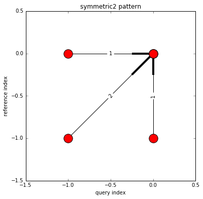
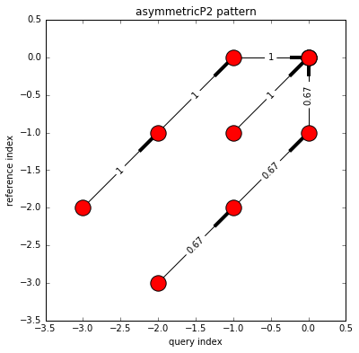
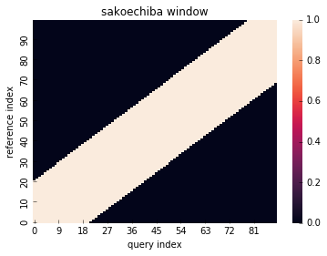
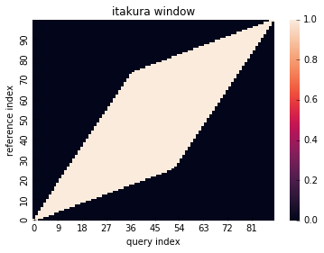

# DTW (Dynamic Time Warping)
[](https://dtwalign.readthedocs.io/en/latest/?badge=latest)
      
Comprehensive dynamic time warping module for python.
Documentation is [available via ReadTheDocs](https://dtwalign.readthedocs.io/en/latest/index.html).

## Installation
```
pip install dtwalign
```

## Features
### Fast computation
---
by [Numba](https://numba.pydata.org)
### Partial alignment
---
  - before alignment


  - after alignment


### Local constraint (step pattern)
---
example:

| Symmetric2 | AsymmetricP2 | TypeIVc |
|:-----------:|:------------:|:------------:|
|  |  |  |

### Global constraint (windowing)
---
example:

| Sakoechiba | Itakura | User defined |
|:-----------:|:------------:|:------------:|
|  |  |  |

### Alignment path visualization
---


## Usage
see [example](https://htmlpreview.github.io/?https://github.com/statefb/dtwalign/blob/master/example/example.html)

## Reference
1. Sakoe, H.; Chiba, S., Dynamic programming algorithm optimization for spoken word recognition, Acoustics, Speech, and Signal Processing

* Paolo Tormene, Toni Giorgino, Silvana Quaglini, Mario Stefanelli (2008). Matching Incomplete Time Series with Dynamic Time Warping: An Algorithm and an Application to Post-Stroke Rehabilitation. Artificial Intelligence in Medicine, 45(1), 11-34.

* Toni Giorgino (2009). Computing and Visualizing Dynamic Time Warping Alignments in R: The dtw Package. Journal of Statistical Software, 31(7), 1-24.
