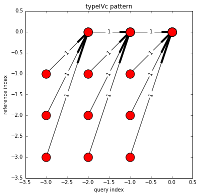
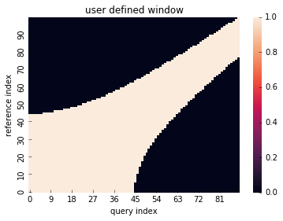
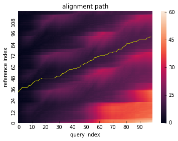

# DTW (Dynamic Time Warping)
Comprehensive dynamic time warping module for python.

## Features
* Fast computation by [Numba](https://numba.pydata.org)
* Partial alignment

  - before alignment

  - after alignment

* Local constraint(Step pattern)

example:

| Symmetric2 | AsymmetricP2 | TypeIVc |
|:-----------:|:------------:|:------------:|
|  |  |  |

* Global constraint

example:

| Sakoechiba | Itakura | User defined |
|:-----------:|:------------:|:------------:|
|  |  |  |

* Alignment path visualization

## Usage
see [example](./example.ipynb)

## Reference
1. Paolo Tormene, Toni Giorgino, Silvana Quaglini, Mario Stefanelli (2008). Matching Incomplete Time Series with Dynamic Time Warping: An Algorithm and an Application to Post-Stroke Rehabilitation. Artificial Intelligence in Medicine, 45(1), 11-34.

2. Toni Giorgino (2009). Computing and Visualizing Dynamic Time Warping Alignments in R: The dtw Package. Journal of Statistical Software, 31(7), 1-24.
