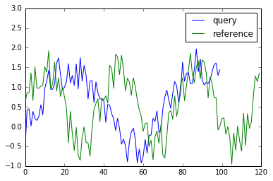
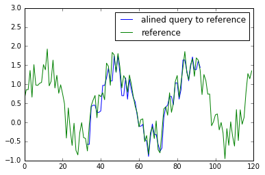

========
Features
========

Fast computation
================
by `Numba <https://numba.pydata.org>`_

Partial alignment
================

* before alignment

* after alignment

Local constraint (step pattern)
================

example: 

.. csv-table::
  :header: "Symmetric2", "AsymmetricP2", "TypeIVc"
  :widths: 15, 15, 15

  .. image:: img/symmetric2.png, .. image:: img/asymmetricP2.png, .. image:: img/typeIVc.png

Global constraint (windowing)
================

example:

.. csv-table::
  :header: "Sakoechiba", "Itakura", "User defined"
  :widths: 15, 15, 15

  .. image:: img/sakoechiba.png, .. image:: img/itakura.png, .. image:: img/user_win.png

Alignment path visualization
================
.. image:: img/partial_path.png
