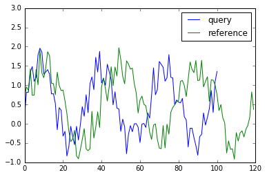
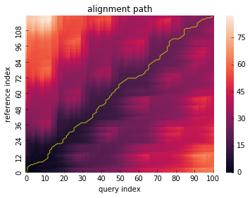
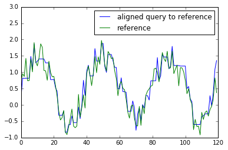
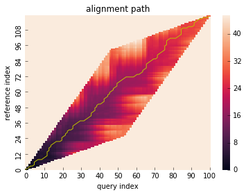
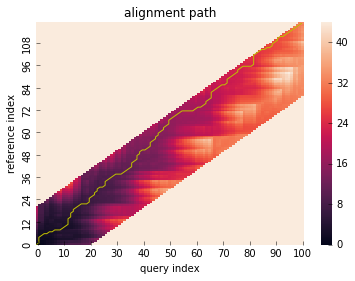
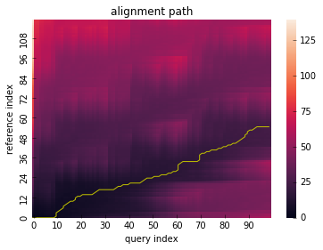
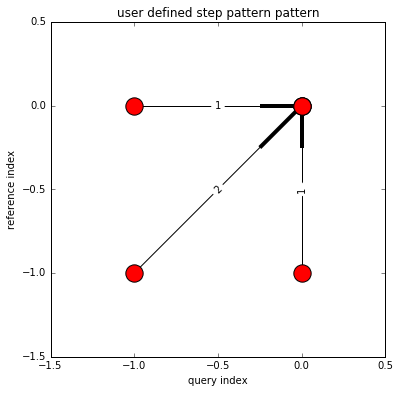
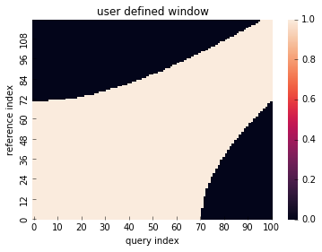

========
Tutorial
========

Basic Usage
===========

Firstly, let's generate toy data for this tutorial.

.. code-block:: python

    import numpy as np
    import matplotlib.pyplot as plt

    np.random.seed(1234)
    # generate toy data
    x = np.sin(2 * np.pi * 3.1 * np.linspace(0, 1, 101))
    x += np.random.rand(x.size)
    y = np.sin(2 * np.pi * 3 * np.linspace(0, 1, 120))
    y += np.random.rand(y.size)

    plt.plot(x, label="query")
    plt.plot(y, label="reference")
    plt.legend()
    plt.ylim(-1, 3)

Then run :func:`~dtwalign.dtw` method which returns :func:`~dtwalign.result.DtwResult` object.

.. code-block:: python

    from dtwalign import dtw
    res = dtw(x, y)

.. note::
    The first run takes a few seconds for jit compilation.

DTW distance
------------

DTW distance can be refered via ``DtwResult`` object.

.. code-block:: python

    print("dtw distance: {}".format(res.distance))
    # dtw distance: 30.048812654583166
    print("dtw normalized distance: {}".format(res.normalized_distance))
    # dtw normalized distance: 0.13596747807503695

.. note::
    If you want to calculate only dtw distance (i.e. no need to gain alignment path),
    give 'distance_only' argument as True when runs `dtw` method (it makes faster).

Alignment path
--------------

``DtwResult`` object offers a method which visualize alignment path with cumsum cost matrix.

.. code-block:: python

    res.plot_path()

Alignment path array is also provided:

.. code-block:: python

    x_path = res.path[:, 0]
    y_path = res.path[:, 1]

Warp one to the other
---------------------

:func:`~dtwalign.result.DtwResult.get_warping_path` method provides an alignment path of X with fixed Y and vice versa.

.. code-block:: python

    # warp x to y
    x_warping_path = res.get_warping_path(target="query")
    plt.plot(x[x_warping_path], label="aligned query to reference")
    plt.plot(y, label="reference")
    plt.legend()
    plt.ylim(-1, 3)

.. code-block:: python

    # warp y to x
    y_warping_path = res.get_warping_path(target="reference")
    plt.plot(x, label="query")
    plt.plot(y[y_warping_path], label="aligned reference to query")
    plt.legend()
    plt.ylim(-1, 3)

.. image:: img/tutorial/y_to_x.png

Advanced Usage
==============

Global constraint
-----------------

``dtw`` method can take ``window_type`` parameter to constrain
the warping path globally which is also known as 'windowing'.

.. code-block:: python

    # run DTW with Itakura constraint
    res = dtw(x, y, window_type="itakura")
    res.plot_path()

.. code-block:: python

    # run DTW with Sakoechiba constraint
    res = dtw(x, y, window_type="sakoechiba", window_size=20)
    # visualize alignment path with cumsum cost matrix
    res.plot_path()

Local constraint
----------------

``dtwalign`` package also supports local constrained optimization
which is also known as 'step pattern'.
Following step patterns are supported:

* symmetric1
* symmetric2
* symmetricP05
* symmetricP0
* symmetricP1
* symmetricP2
* Asymmetric
* AsymmetricP0
* AsymmetricP05
* AsymmetricP1
* AsymmetricP2
* TypeIa
* TypeIb
* TypeIc
* TypeId
* TypeIas
* TypeIbs
* TypeIcs
* TypeIds
* TypeIIa
* TypeIIb
* TypeIIc
* TypeIId
* TypeIIIc
* TypeIVc
* Mori2006

.. code-block:: python

    # run DTW with symmetricP2 pattern
    res = dtw(x, y, step_pattern="symmetricP2")
    res.plot_path()

.. image:: img/tutorial/local-constrained.png

Partial alignment
-----------------

``dtw`` method also be able to perform partial matching algorithm
by setting ``open_begin`` and ``open_end``.
Before see example code, let's make toy data via following:

.. code-block:: python
    
    x_partial = np.sin(2 * np.pi * 3 * np.linspace(0.3, 0.8, 100))
    x_partial += np.random.rand(x_partial.size)
    y_partial = np.sin(2 * np.pi * 3.1 * np.linspace(0, 1, 120))
    y_partial += np.random.rand(y_partial.size)

    plt.plot(x_partial, label="query")
    plt.plot(y_partial, label="reference")
    plt.legend()
    plt.ylim(-1, 3)

.. image:: img/tutorial/toy_data_partial.png

Open-end alignment can be performed by letting ``open_end`` be ``True``.

.. code-block:: python

    res = dtw(x_partial, y_partial, open_end=True)
    res.plot_path()

As above, let ``open_begin`` be ``True`` to run open-begin alignment.

.. note::
    Open-begin requires "N" normalizable pattern.  
    If you want to know more detail, see `references <index.html#references>`_.

.. code-block:: python

    res = dtw(x_partial, y_partial, step_pattern="asymmetric", open_begin=True)
    res.plot_path()

.. image:: img/tutorial/open_begin.png

.. code-block:: python

    res = dtw(x_partial, y_partial, step_pattern="asymmetric", open_begin=True, open_end=True)
    res.plot_path()

.. image:: img/tutorial/open_begin_end.png

Use other metric
----------------

You can use other pair-wise distance metric (default is euclidean).
Metrics in ``scipy.spatial.distance.cdist`` are supported:

.. code-block:: python

    res = dtw(x, y, dist="minkowski")

Arbitrary function which returns distance value between x and y is also available.

.. code-block:: python

    res = dtw(x, y, dist=lambda x, y: np.abs(x - y))

Use pre-computed distance matrix
--------------------------------

You can also calculate DTW with given pre-computed distance matrix like:

.. code-block:: python

    # calculate pair-wise distance matrix in advance
    from scipy.spatial.distance import cdist
    X = cdist(x[:, np.newaxis], y[:, np.newaxis], metric="euclidean")

    # use `dtw_from_distance_matrix` method for computation.
    from dtwalign import dtw_from_distance_matrix
    res = dtw_from_distance_matrix(X, window_type="itakura", step_pattern="typeIVc")

Use user-defined constraints
----------------------------

Local constraint (step pattern)
~~~~~~~~~~~~~~~~~~~~~~~~~~~~~~~

.. code-block:: python

    # define local constraint (step pattern)
    from dtwalign.step_pattern import UserStepPattern
    pattern_info = [
                        dict(
                            indices=[(-1,0),(0,0)],
                            weights=[1]
                        ),
                        dict(
                            indices=[(-1,-1),(0,0)],
                            weights=[2]
                        ),
                        dict(
                            indices=[(0,-1),(0,0)],
                            weights=[1]
                        )
                    ]
    user_step_pattern = UserStepPattern(pattern_info=pattern_info,normalize_guide="N+M")

    # plot
    user_step_pattern.plot()

Global constraint (windowing)
~~~~~~~~~~~~~~~~~~~~~~~~~~~~~

.. code-block:: python

    # define global constraint (windowing)
    from dtwalign.window import UserWindow
    user_window = UserWindow(X.shape[0], X.shape[1], win_func=lambda i, j: np.abs(i ** 2 - j ** 2) < 5000)

    # plot
    user_window.plot()

To compute DTW with user-specified constraints, use `dtw_low` method like:

.. code-block:: python

    # import lower dtw interface
    from dtwalign import dtw_low
    res = dtw_low(X,window=user_window,pattern=user_step_pattern)
    res.plot_path()

.. image:: img/tutorial/user_path.png